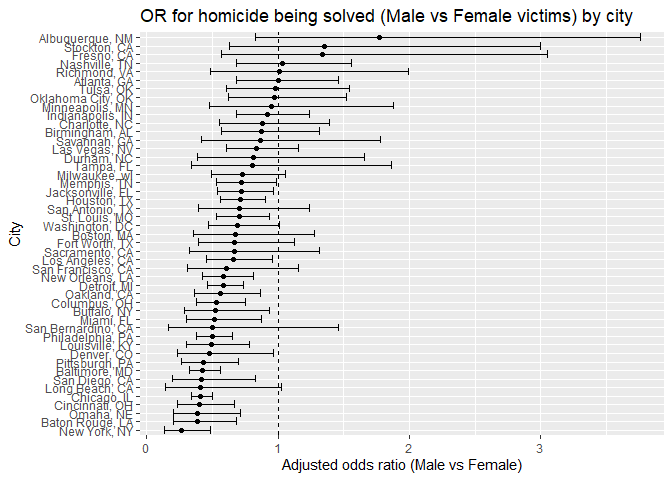

P8105 Homework 6
================
Satya Batna

\#Problem 1

``` r
homicide_raw = read_csv("data/homicide-data.csv")
```

``` r
homicide_df =
  homicide_raw |>
  mutate(
    city_state = str_c(city, state, sep = ", "),
    
      resolved = case_when(
      disposition == "Closed by arrest" ~ 1,
      TRUE ~ 0
    ),
    resolved = factor(resolved),
    
    victim_race = str_to_lower(victim_race),
        victim_age = as.numeric(victim_age)
  ) |>
  filter(
    !city_state %in% c("Dallas, TX",
                       "Phoenix, AZ",
                       "Kansas City, MO",
                       "Tulsa, AL")
  ) |>
  filter(victim_race %in% c("white", "black"))

homicide_df
```

    ## # A tibble: 39,693 × 14
    ##    uid        reported_date victim_last  victim_first victim_race victim_age
    ##    <chr>              <dbl> <chr>        <chr>        <chr>            <dbl>
    ##  1 Alb-000003      20100601 SATTERFIELD  VIVIANA      white               15
    ##  2 Alb-000005      20100102 MULA         VIVIAN       white               72
    ##  3 Alb-000006      20100126 BOOK         GERALDINE    white               91
    ##  4 Alb-000009      20100130 MARTIN-LEYVA GUSTAVO      white               56
    ##  5 Alb-000012      20100218 LUJAN        KEVIN        white               NA
    ##  6 Alb-000016      20100308 GRAY         STEFANIA     white               43
    ##  7 Alb-000018      20100323 DAVID        LARRY        white               52
    ##  8 Alb-000019      20100402 BRITO        ELIZABETH    white               22
    ##  9 Alb-000021      20100423 KING         TEVION       black               15
    ## 10 Alb-000022      20100423 BOYKIN       CEDRIC       black               25
    ## # ℹ 39,683 more rows
    ## # ℹ 8 more variables: victim_sex <chr>, city <chr>, state <chr>, lat <dbl>,
    ## #   lon <dbl>, disposition <chr>, city_state <chr>, resolved <fct>

``` r
# Filter to Baltimore only
baltimore_df =
  homicide_df |>
  filter(city_state == "Baltimore, MD")

# Logistic regression: resolved vs unresolved
baltimore_fit =
  glm(
    resolved ~ victim_age + victim_sex + victim_race,
    data = baltimore_df,
    family = binomial()
  )

summary(baltimore_fit)
```

    ## 
    ## Call:
    ## glm(formula = resolved ~ victim_age + victim_sex + victim_race, 
    ##     family = binomial(), data = baltimore_df)
    ## 
    ## Coefficients:
    ##                   Estimate Std. Error z value Pr(>|z|)    
    ## (Intercept)       0.309981   0.171295   1.810   0.0704 .  
    ## victim_age       -0.006727   0.003324  -2.024   0.0430 *  
    ## victim_sexMale   -0.854463   0.138176  -6.184 6.26e-10 ***
    ## victim_racewhite  0.841756   0.174716   4.818 1.45e-06 ***
    ## ---
    ## Signif. codes:  0 '***' 0.001 '**' 0.01 '*' 0.05 '.' 0.1 ' ' 1
    ## 
    ## (Dispersion parameter for binomial family taken to be 1)
    ## 
    ##     Null deviance: 3567.9  on 2752  degrees of freedom
    ## Residual deviance: 3492.7  on 2749  degrees of freedom
    ## AIC: 3500.7
    ## 
    ## Number of Fisher Scoring iterations: 4

``` r
baltimore_tidy =
  tidy(baltimore_fit, conf.int = TRUE, exponentiate = TRUE)

baltimore_tidy
```

    ## # A tibble: 4 × 7
    ##   term             estimate std.error statistic  p.value conf.low conf.high
    ##   <chr>               <dbl>     <dbl>     <dbl>    <dbl>    <dbl>     <dbl>
    ## 1 (Intercept)         1.36    0.171        1.81 7.04e- 2    0.976     1.91 
    ## 2 victim_age          0.993   0.00332     -2.02 4.30e- 2    0.987     1.000
    ## 3 victim_sexMale      0.426   0.138       -6.18 6.26e-10    0.324     0.558
    ## 4 victim_racewhite    2.32    0.175        4.82 1.45e- 6    1.65      3.28

``` r
city_or =
  homicide_df |>
  nest(data = -city_state) |>
  mutate(
    fit = map(
      data,
      ~ glm(
          resolved ~ victim_age + victim_sex + victim_race,
          data = .x,
          family = binomial()
        )
    ),
    results = map(
      fit,
      ~ tidy(.x, conf.int = TRUE, exponentiate = TRUE)
    )
  ) |>
  select(city_state, results) |>
  unnest(results) |>
  filter(term == "victim_sexMale") |>
  select(city_state, estimate, conf.low, conf.high)

city_or
```

    ## # A tibble: 47 × 4
    ##    city_state      estimate conf.low conf.high
    ##    <chr>              <dbl>    <dbl>     <dbl>
    ##  1 Albuquerque, NM    1.77     0.825     3.76 
    ##  2 Atlanta, GA        1.00     0.680     1.46 
    ##  3 Baltimore, MD      0.426    0.324     0.558
    ##  4 Baton Rouge, LA    0.381    0.204     0.684
    ##  5 Birmingham, AL     0.870    0.571     1.31 
    ##  6 Boston, MA         0.674    0.353     1.28 
    ##  7 Buffalo, NY        0.521    0.288     0.936
    ##  8 Charlotte, NC      0.884    0.551     1.39 
    ##  9 Chicago, IL        0.410    0.336     0.501
    ## 10 Cincinnati, OH     0.400    0.231     0.667
    ## # ℹ 37 more rows

``` r
# reorder cities by OR
city_or_plot =
  city_or |>
  mutate(city_state = forcats::fct_reorder(city_state, estimate))

# make the plot
city_or_plot |>
  ggplot(aes(x = estimate, y = city_state)) +
  geom_point() +
  geom_errorbar(aes(xmin = conf.low, xmax = conf.high)) +
  geom_vline(xintercept = 1, linetype = "dashed") +
  labs(
    x = "Adjusted odds ratio (Male vs Female)",
    y = "City",
    title = "OR for homicide being solved (Male vs Female victims) by city"
  )
```


