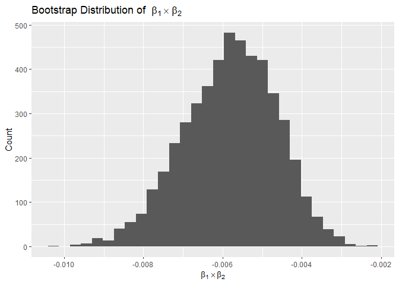
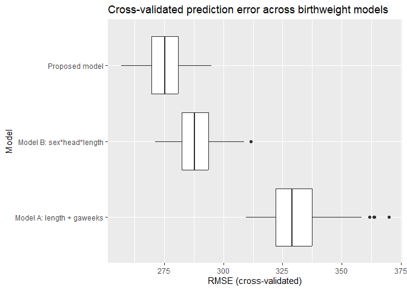

P8105 Homework 6
================
Satya Batna

``` r
knitr::opts_chunk$set(
  echo = TRUE,
  warning = FALSE,
  message = FALSE,
  fig.width = 7,
  fig.height = 5,
  out.width = "80%"
)

library(tidyverse)
library(broom)
library(purrr)
library(modelr)
library(p8105.datasets)
library(janitor)
```

**Problem 1**

    ## # A tibble: 39,693 × 14
    ##    uid        reported_date victim_last  victim_first victim_race victim_age
    ##    <chr>              <dbl> <chr>        <chr>        <chr>            <dbl>
    ##  1 Alb-000003      20100601 SATTERFIELD  VIVIANA      white               15
    ##  2 Alb-000005      20100102 MULA         VIVIAN       white               72
    ##  3 Alb-000006      20100126 BOOK         GERALDINE    white               91
    ##  4 Alb-000009      20100130 MARTIN-LEYVA GUSTAVO      white               56
    ##  5 Alb-000012      20100218 LUJAN        KEVIN        white               NA
    ##  6 Alb-000016      20100308 GRAY         STEFANIA     white               43
    ##  7 Alb-000018      20100323 DAVID        LARRY        white               52
    ##  8 Alb-000019      20100402 BRITO        ELIZABETH    white               22
    ##  9 Alb-000021      20100423 KING         TEVION       black               15
    ## 10 Alb-000022      20100423 BOYKIN       CEDRIC       black               25
    ## # ℹ 39,683 more rows
    ## # ℹ 8 more variables: victim_sex <chr>, city <chr>, state <chr>, lat <dbl>,
    ## #   lon <dbl>, disposition <chr>, city_state <chr>, resolved <fct>

    ## 
    ## Call:
    ## glm(formula = resolved ~ victim_age + victim_sex + victim_race, 
    ##     family = binomial(), data = baltimore_df)
    ## 
    ## Coefficients:
    ##                   Estimate Std. Error z value Pr(>|z|)    
    ## (Intercept)       0.309981   0.171295   1.810   0.0704 .  
    ## victim_age       -0.006727   0.003324  -2.024   0.0430 *  
    ## victim_sexMale   -0.854463   0.138176  -6.184 6.26e-10 ***
    ## victim_racewhite  0.841756   0.174716   4.818 1.45e-06 ***
    ## ---
    ## Signif. codes:  0 '***' 0.001 '**' 0.01 '*' 0.05 '.' 0.1 ' ' 1
    ## 
    ## (Dispersion parameter for binomial family taken to be 1)
    ## 
    ##     Null deviance: 3567.9  on 2752  degrees of freedom
    ## Residual deviance: 3492.7  on 2749  degrees of freedom
    ## AIC: 3500.7
    ## 
    ## Number of Fisher Scoring iterations: 4

    ## # A tibble: 4 × 7
    ##   term             estimate std.error statistic  p.value conf.low conf.high
    ##   <chr>               <dbl>     <dbl>     <dbl>    <dbl>    <dbl>     <dbl>
    ## 1 (Intercept)         1.36    0.171        1.81 7.04e- 2    0.976     1.91 
    ## 2 victim_age          0.993   0.00332     -2.02 4.30e- 2    0.987     1.000
    ## 3 victim_sexMale      0.426   0.138       -6.18 6.26e-10    0.324     0.558
    ## 4 victim_racewhite    2.32    0.175        4.82 1.45e- 6    1.65      3.28

    ## # A tibble: 47 × 4
    ##    city_state      estimate conf.low conf.high
    ##    <chr>              <dbl>    <dbl>     <dbl>
    ##  1 Albuquerque, NM    1.77     0.825     3.76 
    ##  2 Atlanta, GA        1.00     0.680     1.46 
    ##  3 Baltimore, MD      0.426    0.324     0.558
    ##  4 Baton Rouge, LA    0.381    0.204     0.684
    ##  5 Birmingham, AL     0.870    0.571     1.31 
    ##  6 Boston, MA         0.674    0.353     1.28 
    ##  7 Buffalo, NY        0.521    0.288     0.936
    ##  8 Charlotte, NC      0.884    0.551     1.39 
    ##  9 Chicago, IL        0.410    0.336     0.501
    ## 10 Cincinnati, OH     0.400    0.231     0.667
    ## # ℹ 37 more rows


The Washington Post articles discussed how half of murders going
unsolved in the US. In this analysis, we see that most cities show
adjusted odds ratios below 1, indicating that homicides with male
victims are less likely to be solved than those with female victims
after adjusting for age and race. Cities such as Baltimore show
particularly low odds of resolving cases involving male victims, which
are consistent with the findings of the article. Overall, these results
suggest significant sex-based disparities in justice outcomes across
U.S. cities.

**Problem 2**



    ## # A tibble: 1 × 2
    ##     low  high
    ##   <dbl> <dbl>
    ## 1 0.934 0.947

    ## # A tibble: 1 × 2
    ##        low     high
    ##      <dbl>    <dbl>
    ## 1 -0.00823 -0.00371

Using 5000 bootstrap samples, I found that the model predicting maximum
temperature using minimum temperature and precipitation consistently
performed very well. The distribution of the r-squared values was
centered around 0.94, meaning the model explains about 94% of the
variation in maximum temperature. The 95% confidence interval for r^2
was narrow (0.934 to 0.947), showing that this estimate is very stable
and would likely be similar if new samples were collected.

I also looked at the product of the two regression coefficients (beta1
and beta2), which helps us understand how the combined effects of
minimum temperature and precipitation relate to maximum temperature. The
bootstrap distribution for this statistic was around -0.006, and the 95%
confidence interval (–0.00823 to –0.00371) was entirely negative. This
suggests that higher precipitation slightly reduces the positive
relationship between minimum and maximum temperature.

**Problem 3**

    ## # A tibble: 1 × 20
    ##   babysex bhead blength   bwt delwt fincome frace gaweeks malform menarche
    ##     <int> <int>   <int> <int> <int>   <int> <int>   <int>   <int>    <int>
    ## 1       0     0       0     0     0       0     0       0       0        0
    ## # ℹ 10 more variables: mheight <int>, momage <int>, mrace <int>, parity <int>,
    ## #   pnumlbw <int>, pnumsga <int>, ppbmi <int>, ppwt <int>, smoken <int>,
    ## #   wtgain <int>

    ## 
    ## Call:
    ## lm(formula = bwt ~ babysex + bhead + blength + gaweeks + ppbmi + 
    ##     wtgain + smoken + momage + mrace, data = birth_df)
    ## 
    ## Residuals:
    ##      Min       1Q   Median       3Q      Max 
    ## -1075.58  -186.53    -4.51   177.81  2396.14 
    ## 
    ## Coefficients:
    ##                 Estimate Std. Error t value Pr(>|t|)    
    ## (Intercept)   -5776.9052   102.7701 -56.212  < 2e-16 ***
    ## babysexfemale    31.9763     8.5071   3.759 0.000173 ***
    ## bhead           132.0940     3.4664  38.106  < 2e-16 ***
    ## blength          76.4761     2.0193  37.872  < 2e-16 ***
    ## gaweeks          11.0829     1.4691   7.544 5.52e-14 ***
    ## ppbmi             6.8413     1.3445   5.088 3.76e-07 ***
    ## wtgain            4.1554     0.3965  10.481  < 2e-16 ***
    ## smoken           -4.6227     0.5886  -7.854 5.04e-15 ***
    ## momage            1.9746     1.1705   1.687 0.091689 .  
    ## mrace2         -142.5266     9.8060 -14.535  < 2e-16 ***
    ## mrace3         -104.7026    42.7859  -2.447 0.014439 *  
    ## mrace4         -134.9229    18.8711  -7.150 1.02e-12 ***
    ## ---
    ## Signif. codes:  0 '***' 0.001 '**' 0.01 '*' 0.05 '.' 0.1 ' ' 1
    ## 
    ## Residual standard error: 274.3 on 4330 degrees of freedom
    ## Multiple R-squared:  0.7139, Adjusted R-squared:  0.7132 
    ## F-statistic: 982.4 on 11 and 4330 DF,  p-value: < 2.2e-16


    ## # A tibble: 3 × 3
    ##   model                     mean_rmse sd_rmse
    ##   <chr>                         <dbl>   <dbl>
    ## 1 Model A: length + gaweeks      331.   12.6 
    ## 2 Model B: sex*head*length       288.    8.24
    ## 3 Proposed model                 275.    7.79



I chose predictors based on what is known to influence birthweight in
real life, such as the baby’s size at birth, how long the pregnancy
lasted, the mother’s weight and weight gain during pregnancy, smoking,
age, and race. When I checked the residuals from this model, they were
mostly centered around zero (and were normal distributions) suggesting
that the model fits the data.

Then I compared this model to two simpler models using cross-validated
prediction error. One basic model used only birth length and gestational
age, and another used head circumference, length, sex, and all the
interactions. The simpler models did not predict birthweight as well as
our chosen model, and the proposed model had the lowest prediction
error. This means that including important maternal health and behavior
factors helps improve how accurately we can predict birthweight, and
therefore our model does a better job of capturing what influences a
baby’s size at birth.
